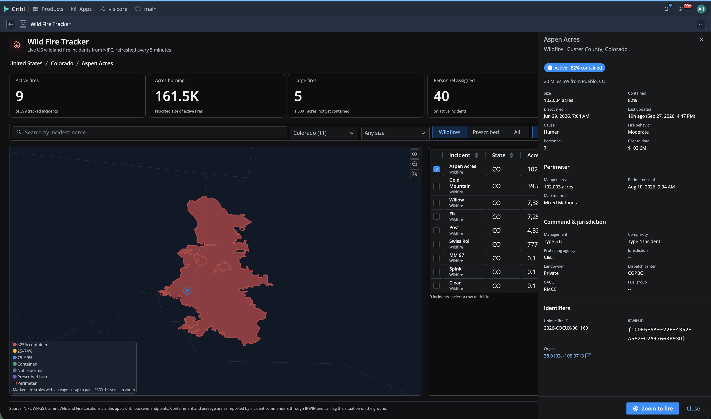
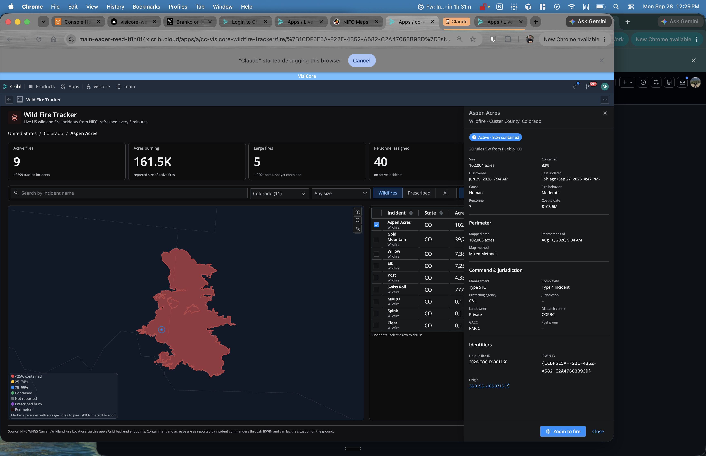

# Wild Fire Tracker

Live map of every wildland fire incident currently tracked in the United States, with drill-down from the national view to a single fire's perimeter.

## Screenshots

Drilling into the Aspen Acres fire in Colorado: the map zooms to the full-resolution NIFC perimeter with county outlines, the table narrows to the state, and the drawer shows size, containment, command, and identifiers.

The same view running inside the Cribl UI as an installed app.

## Summary

Wild Fire Tracker is a Cribl app for situational awareness of active US wildfires. It helps users see where fires are burning right now, understand how large and how contained each one is, and drill into any incident for command, jurisdiction, and perimeter details.

## What This App Does

* Primary purpose: overlay current NIFC wildfire incidents and perimeters on an interactive US map and let users drill down state by state and fire by fire.
* Key capabilities:
  * Interactive map of the US with incident markers sized by acreage and colored by containment, plus current fire perimeter polygons.
  * Drill-down: click a state to focus it, click a marker or table row to open the incident, zoom to the full-resolution perimeter with county outlines.
  * Filters for state, incident type (wildfire vs. prescribed burn), status, minimum size, and name search; filter preferences persist in the app's KV store.
  * Summary tiles (active fires, acres burning, large fires, personnel, new this week) and a sortable incident table.
  * Auto-refresh every 5 minutes plus a manual refresh; all data is fetched server-side by the app's Cribl backend endpoints.
* Intended users: analysts, operations teams, and anyone monitoring wildfire activity from within Cribl.
* Works with: Cribl.Cloud and hybrid deployments that support the App Platform with backend endpoints.

## When To Use This App

* Watch wildfire activity during fire season without leaving Cribl.
* Check size, containment, and staffing of a specific incident near infrastructure or people you care about.
* Correlate outside events (fires) with what you see in your own telemetry.

## Before You Install

* Required Cribl product or deployment type: Cribl.Cloud (or a Leader with App Platform backend support).
* Required permissions or roles: none beyond being shared the app. The app declares no Cribl product API policies.
* Required external systems or APIs: NIFC (National Interagency Fire Center) WFIGS ArcGIS feature services at `services3.arcgis.com`. Public, read-only, no API key.
* Required configuration values: none.
* Known limits or prerequisites: the Leader must be able to reach `services3.arcgis.com` over HTTPS.

## Installation

### Install From Marketplace or URL
1. Go to Apps in your Cribl environment.
2. Choose the Marketplace or import from URL option.
3. If the app is available in the Cribl Marketplace, install it directly from there.
4. If the app is distributed as a URL, use the URL to import it.
5. Review the app details (one external domain, no product API policies) and complete installation.

### If The App Is Not Yet In The Cribl Marketplace
1. Download the `.tgz` app package.
2. In Cribl, go to Apps and choose import from file.
3. Upload the downloaded `.tgz` file and complete installation.

## Configuration

| Setting | Required | Description | Example | Scope |
|---|---|---|---|---|
| None | -- | The app works out of the box with no settings. | -- | -- |

## How To Use

### Typical Workflow
1. Open the app from the Apps page. The map loads current incidents and perimeters.
2. Use the filter bar to narrow by state, type, status, or size. The defaults show active wildfires only.
3. Click a state on the map (or pick one in the state filter) to zoom in and list only that state's fires.
4. Click a marker or a table row to open the incident drawer. The map zooms to the fire and loads its full-resolution perimeter.
5. Use **Zoom to fire** in the drawer or the map controls to explore, and **Reset view** to return to the national view.

### First-Run Checklist
* The header shows "Updated just now" and the summary tiles show non-zero counts.
* Markers appear on the map and the legend explains the colors.
* Clicking a marker opens the drawer.

## Permissions

The app reads no Cribl product APIs, so `policies.yml` is empty. Its only platform calls are:

### Cribl API Endpoints Used

| Method | Endpoint | Purpose |
|---|---|---|
| GET | `/api/v1/a/{appId}/endpoints/incidents` | Invoke the app's backend endpoint that fetches and normalizes NIFC incidents |
| GET | `/api/v1/a/{appId}/endpoints/perimeters` | Invoke the app's backend endpoint that fetches fire perimeters (all, or one by `irwinId`) |
| GET / PUT | `/api/v1/a/{appId}/kvstore/prefs/filters` | Remember the user's filter preferences |

Both are app-scoped and granted automatically when the app is shared.

## External API Access

### Default Configuration
* `default/proxies.yml` — allows `services3.arcgis.com`, restricted to the two NIFC WFIGS "Current" layers (incident locations and interagency perimeters).
* `default/policies.yml` — empty; no Cribl product API access.
* `default/backend.yml` — two backend endpoints, `incidents` and `perimeters`.

### External Endpoints
* NIFC WFIGS Current Wildland Fire Locations — point locations and IRWIN attributes for every tracked incident.
* NIFC WFIGS Current Interagency Fire Perimeters — perimeter polygons for incidents that have one.

The browser never talks to NIFC directly; every request goes through the app's backend endpoints and the platform proxy.

## Data And Storage

* KV key `prefs/filters` stores the current user's filter preferences (type, status, minimum size, perimeter toggle). Nothing else is persisted.
* Incident data is fetched live on every load and refresh; it is not cached or stored.
* KV data is removed when the app is uninstalled.

## Support

### Partner Built
This app is built by VisiCore Tech. VisiCore owns support, maintenance, and feature requests for this app. Cribl does not provide direct support for app-specific behavior unless explicitly stated. Contact: Andrew Hendrix, VisiCore Tech.

## Known Limitations

* Data quality depends on what incident commanders report through IRWIN. Containment and acreage can lag, and many small fires never report containment.
* Only incidents in the NIFC "Current" layers are shown; fires that are declared out drop off the feed.
* Incidents outside the lower 48, Alaska, Hawaii, and Puerto Rico (for example Guam) are listed but cannot be drawn on the map projection.
* The basemap is state and county boundaries, not imagery or streets. Use the origin coordinates link in the drawer to open a fire in an external map.

## Troubleshooting

### The App Opens But Some Features Do Not Work
* "Could not load incidents": the backend endpoint could not reach NIFC. Check the Leader's egress to `services3.arcgis.com` and the app's backend deployment status.
* "Perimeters unavailable": incidents loaded but the perimeter layer failed; retry with **Refresh**.

### The App Cannot Connect To An API Or Service
Check the app's proxy declaration (Apps > app > Proxies) lists `services3.arcgis.com`, and that the backend shows as deployed.

### The App Works Locally But Not In Cribl
Confirm the installed version matches the packaged version and that the backend deployment succeeded (`cribl apps backend-status <appId>` with the VisiCore Cribl CLI).
